# 🤖 Smart Assistant for Q&A and Summarization

## 🎥 Demo Video

[▶️ Watch the Demo on Loom](https://www.loom.com/share/50a709f000e54135bf61690752936a9b)

A **Streamlit-based GenAI assistant** that reads and understands content from `.pdf` and `.txt` documents. It performs **contextual Q&A**, **logic-based question generation**, and **source-grounded evaluation**, powered by **Google Gemini 1.5 Flash** and **LangChain**.

> 📁 Upload research papers, legal documents, or technical reports — let the assistant read, reason, and quiz you!

---

## 🎯 Project Objective

This project was built as part of a **GenAI recruitment challenge** by **EZLab**, aiming to develop an AI-powered assistant capable of:

- 📚 Understanding complex documents  
- ❓ Answering free-form questions with citations  
- 🧠 Generating logic-based questions for users  
- ✅ Evaluating user answers with constructive feedback  
- 🔍 Justifying all responses using document-grounded evidence  

---

## 🚀 Key Features

- 📄 **Multi-format Upload**: Accepts `.pdf` and `.txt` files  
- ✍️ **Auto-Summarization**: Concise <150-word summary per document  
- 💬 **Ask Anything**: Conversational Q&A with supporting quotes  
- 🧠 **Challenge Mode**:  
  - Generates logic/reasoning-based questions  
  - Evaluates answers and provides feedback  
- 📚 **Document Grounding**: Every answer includes exact sources; no hallucinations  

---

## 🧠 How It Works

### 📝 Document Parsing
- Uses **PyPDF2** and UTF-8 decoding to extract structured content  
- Retains page numbers and source names for traceability  

### 🔍 Vector Store Creation
- Uses `RecursiveCharacterTextSplitter` for efficient chunking  
- Embeds chunks using **Google GenerativeAI Embeddings**  
- Stores vectors locally using **FAISS**  

### 💬 Q&A & Feedback Loop
- Uses `ChatGoogleGenerativeAI` (Gemini 1.5 Flash) via LangChain  
- Employs a structured prompt for grounded Q&A  
- Evaluates user answers with rubric-based criteria (accuracy, completeness, citation)  

---

## 🏗️ Tech Stack

| Layer         | Technology Used                         |
|---------------|------------------------------------------|
| UI            | Streamlit                                |
| LLM Backend   | Google Gemini 1.5 Flash (`langchain-google-genai`) |
| Vector Store  | FAISS                                     |
| Parsing       | PyPDF2, UTF-8 Decoding                   |
| Environment   | `python-dotenv`                          |
| Chaining Logic| LangChain                                |

---

## 📦 Installation

### 🧰 Prerequisites

- Python 3.8+
- Google Gemini API Key (add to `.env` as `GOOGLE_API_KEY`)

### 🔧 Setup
1. Clone repository:
```bash
git clone https://github.com/Sunnykumar926/Smart-Assistant-for-Research-Summarization
```
2. Create virtual environment:
```bash
python -m venv my_env
source my_env/bin/activate  # Linux/MacOS
my_env\Scripts\activate    # Windows
```
3. Install dependencies:
```bash
pip install -r requirements.txt
```
4. Create `.env` file with your API key:
```bash
GOOGLE_API_KEY=your_api_key_here
```
5. Run your file
```bash
streamlit run app.py
```
## 🔍 Workflow Diagram

```mermaid
graph TD
    A[📂 Document Upload] --> B[📝 Text Extraction]
    B --> C[🔗 Chunk Splitting]
    C --> D[🔍 Vector Embedding]
    D --> E[🗂️ FAISS Storage]
    E --> F{🤖 User Interaction}
    F --> G[💬 Question Answering]
    F --> H[🧠 Knowledge Validation]
    G --> I[📝 Response Generation]
    H --> J[❓ Question Creation]
    J --> K[✅ Answer Evaluation]
```


---
## 👨‍💻 Author

**Sunny Kumar**  
✨ Developed for EZLab's GenAI task


